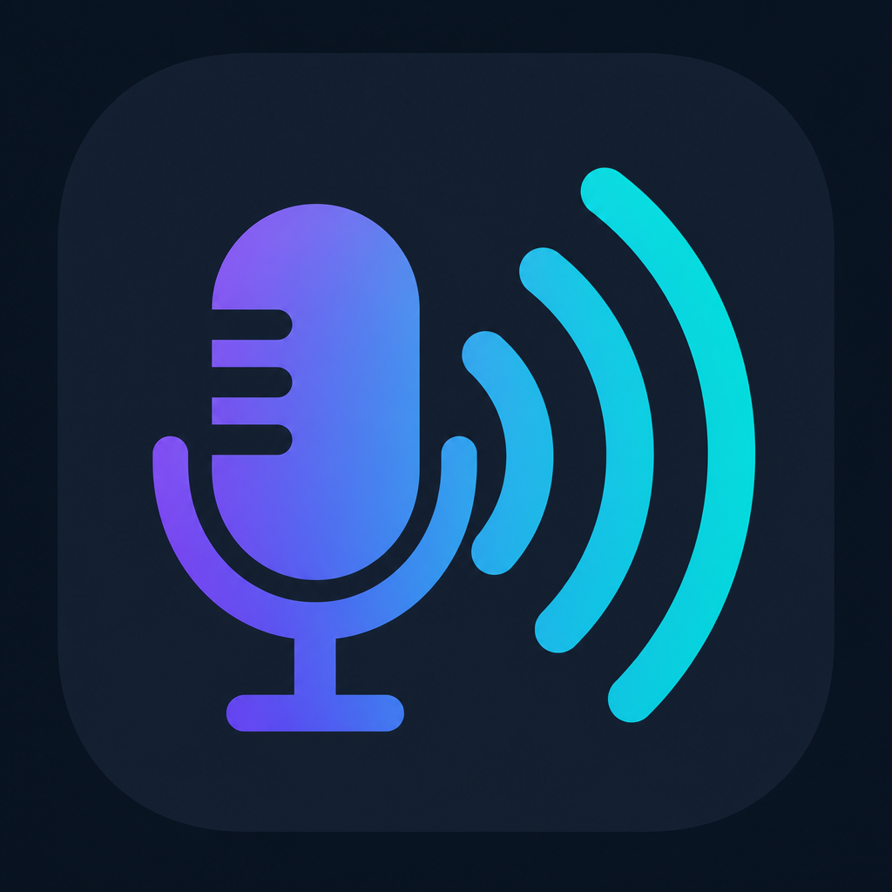

# Soundboard

A Windows soundboard that mixes your **microphone** with sound clips and sends the result to a **virtual microphone** — so Discord, OBS, and games hear your voice **and** your sound effects.



## Features

- Mix live mic + soundboard clips into one output stream
- Route output to a virtual cable (virtual mic for other apps)
- Hear clips locally on your speakers/headphones (monitor)
- Global hotkeys (press-to-bind)
- Per-sound volume sliders
- Import WAV, MP3, and other common formats
- Local storage for sounds, hotkeys, and settings

---

## Requirements

- **Windows 10 or 11**
- **[.NET 8 Desktop Runtime](https://dotnet.microsoft.com/download/dotnet/8.0)** (or SDK to build from source)
- **[VB-Audio Virtual Cable](https://vb-audio.com/Cable/)** (free) — creates the virtual mic

---

## Quick install (virtual mic)

### 1. Install VB-CABLE (virtual audio device)

1. Download **VB-CABLE** from [vb-audio.com/Cable](https://vb-audio.com/Cable/)
2. Extract and run **`VBCABLE_Setup_x64.exe`** as Administrator
3. Reboot if Windows asks you to
4. After reboot, open **Sound settings** and confirm you see:
   - **CABLE Input** (playback device — the app sends audio here)
   - **CABLE Output** (recording device — Discord uses this as your mic)

> The app can also open the VB-CABLE download page via **Install VB-CABLE** if no virtual cable is detected.

### 2. Install / run Soundboard

**Option A — Run from source (developers)**

```powershell
git clone https://github.com/JafarBadour/soundboard-add-to-mic.git soundboard
cd soundboard
dotnet run --project .\src\Soundboard.App\Soundboard.App.csproj
```

**Option B — Build a standalone app**

```powershell
dotnet publish .\src\Soundboard.App\Soundboard.App.csproj -c Release -r win-x64 --self-contained false
```

The executable will be in:

`src\Soundboard.App\bin\Release\net8.0-windows\win-x64\publish\Soundboard.exe`

---

## Setup in the app

1. **Input microphone** — your real mic
2. **Output** — **`CABLE Input (VB-Audio Virtual Cable)`**  
   ⚠️ Do **not** pick your speakers here
3. **Hear sounds on my speakers/headphones** — keep checked to hear clips locally
4. **Local monitor device** — your headphones/speakers
5. Click **Start**

### Discord / OBS / games

Set the **microphone input** to:

**`CABLE Output (VB-Audio Virtual Cable)`**

---

## How the audio routing works

```
Your mic ──────┐
               ├──► Soundboard app ──► CABLE Input ──► CABLE Output ──► Discord / game
Sound clips ───┘                              │
                                              └──► Your headphones (monitor)
```

- **CABLE Input** = where Soundboard **plays** mixed audio
- **CABLE Output** = what other apps use as a **microphone**

---

## Using the soundboard

| Action | How |
|--------|-----|
| Import a sound | **Import sound…** → pick a file |
| Adjust volume | Drag the **Volume** slider (0–100%) |
| Play a sound | **Play** (engine must be running) |
| Bind a hotkey | **Bind hotkey** → press combo (e.g. `Ctrl+Alt+F1`) |
| Remove hotkey | **Clear** |
| Cancel binding | **Esc** or **Cancel** |

Imported sounds are stored under:

`%LOCALAPPDATA%\Soundboard\clips\`

Settings and metadata are in:

`%LOCALAPPDATA%\Soundboard\soundboard.sqlite`

---

## Troubleshooting

### No sound in Discord

- App **Output** must be **CABLE Input**, not speakers
- Discord mic must be **CABLE Output**
- Click **Start** in the app before using hotkeys

### I only hear myself / no soundboard in Discord

- Make sure the engine is **Running**
- Test with **Play** before using hotkeys
- Lower clip **Volume** if sounds are clipping

### Hotkeys don't work in-game

- Keep Soundboard running (can be minimized)
- Use combos with **Ctrl / Alt / Shift** or **F-keys**
- Some games block global hotkeys — try a different combo

### Voice lag

- Use **CABLE Input** / **CABLE Output** only (not speakers as output)
- Restart the engine after changing devices

---

## GitHub Releases

This repository includes a release workflow at `.github/workflows/release.yml`.

To publish a release:

```powershell
git add .
git commit -m "Prepare release v1.0.0"
git tag v1.0.0
git push origin dev
git push origin v1.0.0
```

When the tag is pushed, GitHub Actions will:
- run tests
- publish the app for `win-x64`
- attach a `.zip` build artifact to the GitHub release page

---

## Development

```powershell
dotnet build .\Soundboard.sln -c Release
dotnet test .\tests\Soundboard.Core.Tests\Soundboard.Core.Tests.csproj
```

### Project structure

| Project | Purpose |
|---------|---------|
| `Soundboard.App` | WPF UI |
| `Soundboard.Core` | Audio engine, hotkeys, storage |
| `Soundboard.Core.Tests` | Unit & hardware tests |

---

## License

See `LICENSE`.
